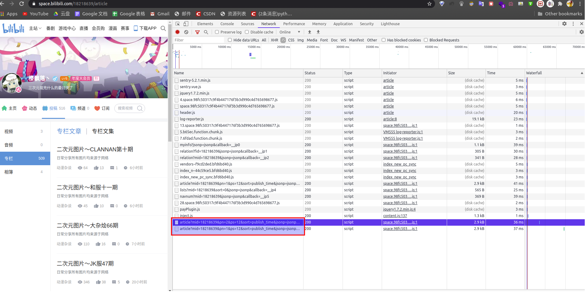
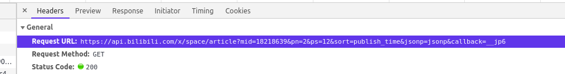
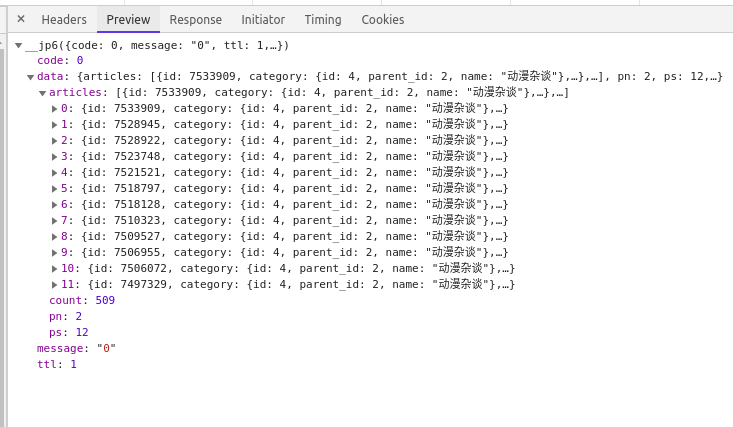
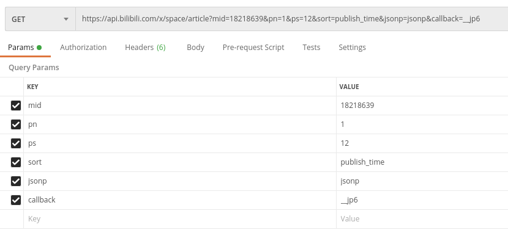

# Go解析JSON

## 1. 入门

### 1.0 基础

使用的库：`encoding/json`

go解析json没有python方便，python一个`json.loads()`就行

Go解析json的步骤:

> 1.新建一个对应的结构体
>
> 2.使用`json.Unmarshal()`读取字节数据并返回一个`{}`

### 1.1 先来个简单的

```go
var mine = `{
    "name":"Joe",
    "age":23,
    "height":175.0,
    "scores":[80,90,100]
}`

// 则结构体为
type Mine struct {
	Name 	string 		`json:"name"`
	Age 	int 		`json:"age"`
	Height 	float32 	`json:"height"`
	Scores 	[]int		`json:"scores"`
}

func main() {
	info := Mine{}
	err := json.Unmarshal([]byte(mine), &info)
	if err != nil{
		log.Fatalln(err)
		//print("error:  ", err)
	}
	fmt.Println(info)
	fmt.Println(info.Name)
	fmt.Println(info.Scores)
}
/* 
打印结果为
{Joe 23 175.5 [80 90 100]}
Joe
[80 90 100]
*/

```


### 1.2 试试嵌套一个`map`

```go
var inmap = `{
	"name":"Joe",
	"age":23,
	"height":175.5,
	"Scores":{
		"C":60,
		"Go":70,
		"Python":80
	}
}`

type InMap struct {
	Name 	string 			`json:"name"`
	Age 	int 			`json:"age"`
	Height 	float32 		`json:"height"`
	Scores 	Scores	`json:"scores"`
}

type Scores struct {
	LessonC 		int 	`json:"C"`
	LessonGo 		int 	`json:"Go"`
	LessonPython 	int 	`json:"Python"`
}

// 1.2 map in map
info2 := InMap{}
err = json.Unmarshal([]byte(inmap), &info2)
if err != nil{
    log.Fatalln(err)
    //print("error:  ", err)
}
fmt.Println(info2)
fmt.Println(info2.Name)
fmt.Println(info2.Scores)
fmt.Println(info2.Scores.LessonC)


/*
打印结果为
{Joe 23 175.5 {60 70 80}}
Joe
{60 70 80}
60
*/
```

## 2. 实战 获取B站某up的所有专栏id

### 2.0 分析网页

首先找一个专栏图多的UP，比如https://space.bilibili.com/18218639/article。打开专栏页面，右键查看源代码，发现只有很少的代码，那就是动态加载的了。

按`F12`，点开`Network`选项，过滤`JS`，点击下一个页面，看看有何变化。



可以看到多了一条，那就点开开始分析了。

请求url是：https://api.bilibili.com/x/space/article?mid=18218639&pn=1&ps=12&sort=publish_time&jsonp=jsonp&callback=__jp6



相应内容如下图，这不就是专栏的id吗！来，接着分析下url。



### 2.1  分析url

https://api.bilibili.com/x/space/article?mid=18218639&pn=1&ps=12&sort=publish_time&jsonp=jsonp&callback=__jp6




可以看出url中有几个参数

|   参数   |                           推测含义                           |
| :------: | :----------------------------------------------------------: |
|   mid    |                       mid与UP的id一样                        |
|    pn    |                 翻页时pn会变化，pn表示第几页                 |
|    ps    | ps数值不变，一直是12，并且网页每次加载的专栏数就是12，<br>可以猜到，pn和ps都是分页的参数 |
|   sort   |                     很好理解了，就是排序                     |
|  jsonp   |                            不清楚                            |
| callback |                           回调机制                           |


下面用`postman`来分析一下分页机制。

1. 首先输入整段url，发现返回出错，把`callback`参数删去即可。

2. 接着依次删去`jsonp` `sort` ，发现照样能正常返回

3. 修改pn与ps的值为1，https://api.bilibili.com/x/space/article?mid=18218639&pn=1&ps=1

响应内容为

```json
{
    "code": 0,
    "message": "0",
    "ttl": 1,
    "data": {
        "articles": [
            {
                "id": 7562627,
                "category": {
                    "id": 4,
                    "parent_id": 2,
                    "name": "动漫杂谈"
                },
                "categories": [
                    {
                        "id": 2,
                        "parent_id": 0,
                        "name": "动画"
                    },
                    {
                        "id": 4,
                        "parent_id": 2,
                        "name": "动漫杂谈"
                    }
                ],
                "title": "二次元图片～CLANNAN第十期",
                "summary": "日常分享所有图片均来源于网络",
                "banner_url": "",
                "template_id": 4,
                "state": 0,
                "author": {
                    "mid": 18218639,
                    "name": "樱飘落丶",
                    "face": "http://i2.hdslb.com/bfs/face/57b5b39580afd6b809fe4dc074ad77cb8aadb972.jpg",
                    "pendant": {
                        "pid": 150,
                        "name": "纳米核心",
                        "image": "http://i2.hdslb.com/bfs/face/b67a37542d33d093ff28780848448e0a1c78932a.png",
                        "expire": 0
                    },
                    "official_verify": {
                        "type": -1,
                        "desc": ""
                    },
                    "nameplate": {
                        "nid": 74,
                        "name": "大会员2018年度勋章",
                        "image": "http://i0.hdslb.com/bfs/face/421179426c929dfeaed4117461c83f5d07ffb148.png",
                        "image_small": "http://i2.hdslb.com/bfs/face/682001c2e1c2ae887bdf2a0e18eef61180c48f84.png",
                        "level": "稀有勋章",
                        "condition": "2018.6.26-7.8某一天是年度大会员"
                    },
                    "vip": {
                        "type": 2,
                        "status": 1,
                        "due_date": 0,
                        "vip_pay_type": 0,
                        "theme_type": 0,
                        "label": null
                    }
                },
                "reprint": 0,
                "image_urls": [
                    "https://i0.hdslb.com/bfs/article/b4b00d58152d7892910e80221deb67392950e0c1.png"
                ],
                "publish_time": 1599790928,
                "ctime": 1599790928,
                "stats": {
                    "view": 69,
                    "favorite": 1,
                    "like": 14,
                    "dislike": 0,
                    "reply": 1,
                    "share": 0,
                    "coin": 2,
                    "dynamic": 0
                },
                "tags": [
                    {
                        "tid": 4402,
                        "name": "美少女"
                    },
                    {
                        "tid": 9103,
                        "name": "团子大家族"
                    }
                ],
                "words": 23,
                "origin_image_urls": [
                    "https://i0.hdslb.com/bfs/article/524c38ff71750c9291e8aa17abdf7a5223e19517.jpg"
                ],
                "list": null,
                "is_like": false,
                "media": {
                    "score": 0,
                    "media_id": 0,
                    "title": "",
                    "cover": "",
                    "area": "",
                    "type_id": 0,
                    "type_name": "",
                    "spoiler": 0
                },
                "apply_time": "",
                "check_time": "",
                "original": 0,
                "act_id": 0,
                "dispute": {
                    "dispute": "",
                    "dispute_url": ""
                }
            }
        ],
        "pn": 1,
        "ps": 1,
        "count": 509
    }
}
```

这就是一个专栏的信息，要获取id的话，需要提取出`[data][articles]`数组下json对象的所有id字段。

接着可以看到最下面的`data`中的`count`值是509，跟UP的专栏数一样，那么修改`ps`字段一次获取全部专栏信息可行不可行？下面就来试试。

https://api.bilibili.com/x/space/article?mid=18218639&pn=1&ps=509

返回一共3258行，一条专栏信息118行，大概是30倍，看来不行。但是此时的`ps`字段值为30，表示返回了30条专栏信息，下面就好办了.

`ps`=30，一次获取30条，只用修改`pn`字段获取不同的页数就行了。

确定步骤：

> 首先用 `pn`=1 `ps`=1 得到`count`值
>
> 计算一共有多少页，`pages = count/30 + 1`
>
> 然后加个循环多次请求获取id

### 2.2 解析JSON

首先定义结构体

```go
type bili struct {
	Data data  `json:"data"`
}

type data struct {
	Artilce []artilces `json:"articles"`
	Count int `json:"count"`
}

type artilces struct {
	Id 		int 		`json:"id"`
	Title 	string 		`json:"title"`
}

// 获取count
// url 为 https://api.bilibili.com/x/space/article?mid=18218639&pn=1&ps=1
func getCount(url string) int {
	res, err := http.Get(url)
	if err != nil {
		print(err)
	}
	//defer res.Body.Close()
	body, _:= ioutil.ReadAll(res.Body)
	bi := bili{}
	err = json.Unmarshal(body, &bi)
	if err != nil{
		log.Fatalln(err)
	}
	fmt.Println(bi.Data.Count)
	return bi.Data.Count
}

// 获取所有的id和title,这里用结构体
// 这里的url为 https://api.bilibili.com/x/space/article?mid=18218639
// pn,ps参数由程序自动添加
func getAllids(url string, pages int) []artilces {
	var allIds []artilces
	for i:=1; i< pages+1; i++ {
		currentURL := url + "&pn=" + strconv.Itoa(i) + "&ps=30"
		fmt.Println(currentURL)
		res, err := http.Get(currentURL)
		if err != nil {
			print(err)
		}
		//defer res.Body.Close()
		body, _:= ioutil.ReadAll(res.Body)
		bi := bili{}
		err = json.Unmarshal(body, &bi)
		if err != nil{
			log.Fatalln(err)
		}
		for _,v :=range bi.Data.Artilce {
            // 用结构体存起来
			var temp artilces
			fmt.Println(v.Id, v.Title)
			temp.Id = v.Id
			temp.Title = v.Title
			allIds = append(allIds, temp)
		}
	}
	return allIds
}
```


完整程序在这里：[json_bilibili.go](./json_bilibili.go)

因为我也是刚开始学Go，有一些基础的东西我还不熟悉，比如文件的读写、字符串的处理...

慢慢来吧，这次把id和标题都找出来了，下次要做爬虫了，虽然用`python`写爬虫贼方便，但我还是想练练手，熟悉下Go.


